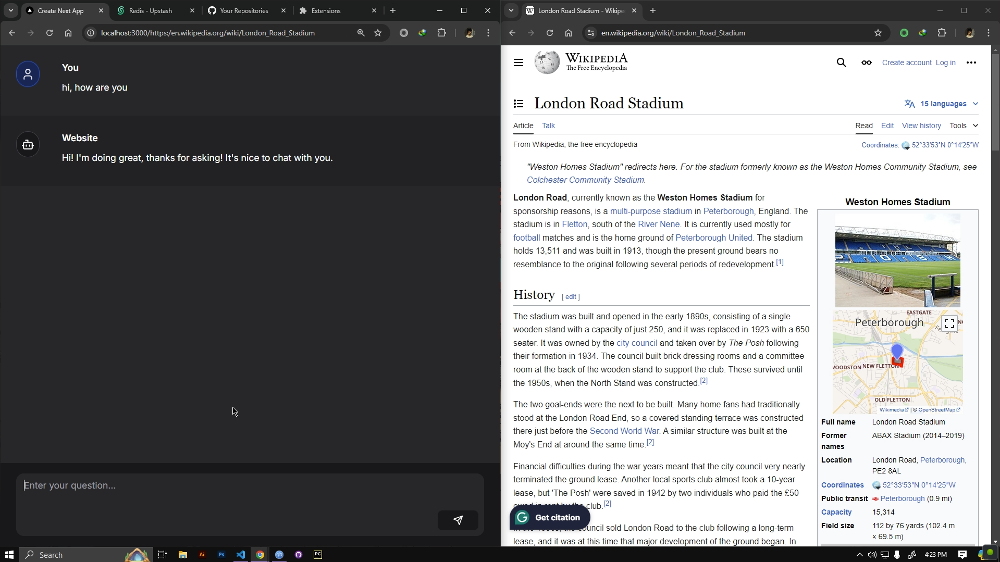
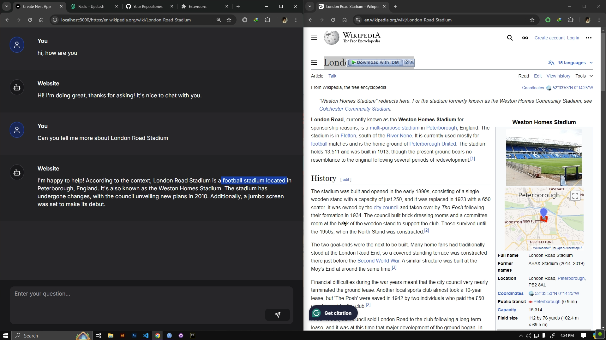
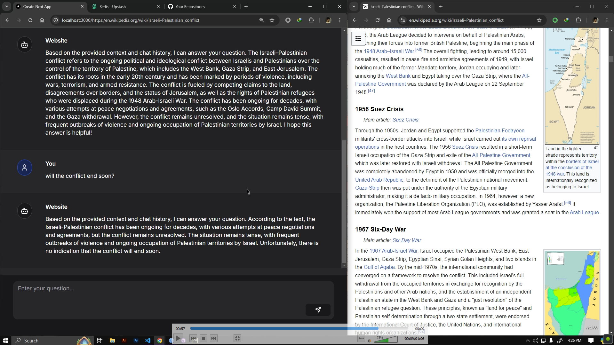
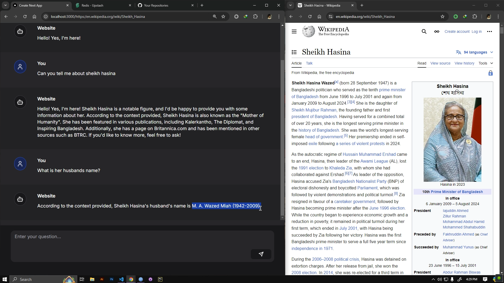

# AI Assistant

Welcome to the AI Assistant project! This website provides an interactive chat interface using advanced language models, integrated with Redis for session management and Upstash for cloud storage.

## Project Overview

The AI Assistant project consists of a Next.js website that leverages modern React components and server-side functionality to create a seamless chat experience. It includes features for managing chat sessions, processing messages, and interacting with a language model hosted on Upstash.


## Features

- Interactive chat interface with real-time messaging.
- Integration with Upstash's RAGChat for advanced language model capabilities.
- Redis-based session management for tracking and indexing chat sessions.
- Dynamic and responsive UI using Next.js and NextUI.

## Technology Stack

- **Next.js**: A React framework for building server-side rendered applications. We are using Next.js with TypeScript for a robust and type-safe development experience.
- **TypeScript**: A typed superset of JavaScript that provides optional static typing. It helps catch errors early and improves the development workflow.
- **NextUI**: A React UI library for building modern web interfaces with a focus on accessibility and ease of use.
- **Upstash RAGChat**: A cloud-based language model service that provides advanced conversational AI capabilities. We are using the `meta-llama/Meta-Llama-3-8B-Instruct` model for generating responses.
- **Redis**: An in-memory data structure store used for session management. Redis helps in efficiently managing user sessions and storing chat histories.
- **Tailwind CSS**: A utility-first CSS framework for styling. It provides a set of low-level utility classes that can be combined to build custom designs.
- **Lucide React**: A collection of icons for React.

## Installation

To get started with the AI Assistant project, follow these steps:

1. **Clone the Repository**

    ```bash
    git clone https://github.com/zhrafin/AI-Assistant.git
    cd AI-Assistant
    ```

2. **Install Dependencies**

    For Python dependencies:
    
    ```bash
    pip install -r requirements.txt
    ```

    For Node.js dependencies:

    ```bash
    npm install
    ```

3. **Set Up Environment Variables**

    Create a `.env` file in the root directory of the project and add the following:


4. **Run the Application**

    For development:

    ```bash
    npm run dev
    ```

    For production:

    ```bash
    npm run build
    npm start
    ```

## Project Structure

- **`/pages`**: Contains the Next.js pages. Includes `page.tsx` for the chat interface and `route.ts` for handling API requests.
- **`/components`**: Contains React components used in the application, such as `ChatWrapper.tsx`, `ChatInput.tsx`, `Messages.tsx`, and `Message.tsx`.
- **`/lib`**: Contains utility files such as `redis.ts` for Redis client configuration and `rag-chat.ts` for setting up the RAGChat instance.
- **`/public`**: Contains static assets and images.
- **`/styles`**: Contains global styles and Tailwind CSS configuration.

## Screenshots

Below are some screenshots showcasing the GUI of the AI Assistant:

<div style="display: flex; gap: 10px; justify-content: center;">
    
    
</div>

<div style="display: flex; gap: 10px; justify-content: center;">
    
    
</div>


## Video Demonstration

Watch the video demonstration of the AI Assistant application:

[Watch Video](demo/IMG_4902.MOV)


---

Feel free to reach out if you have any questions or need further assistance!

